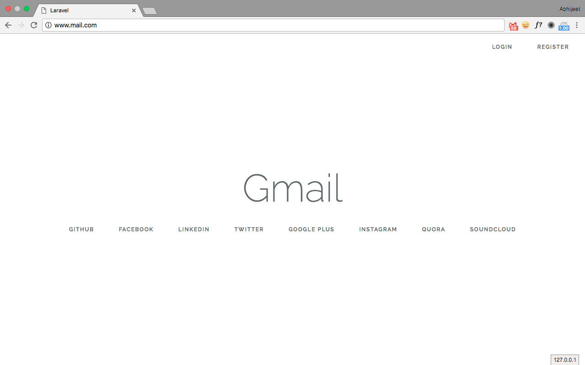
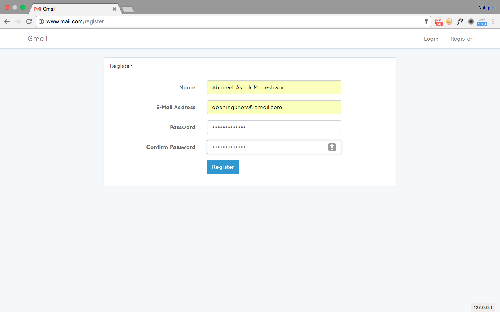
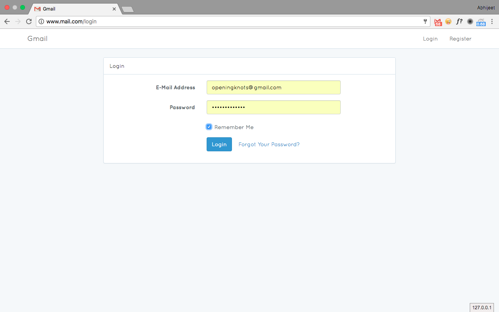
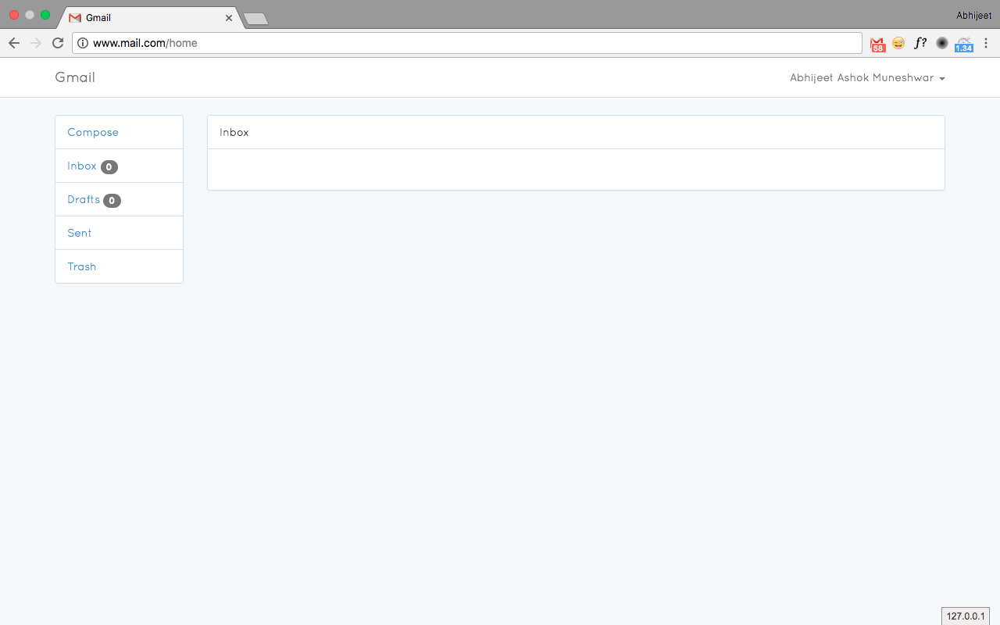
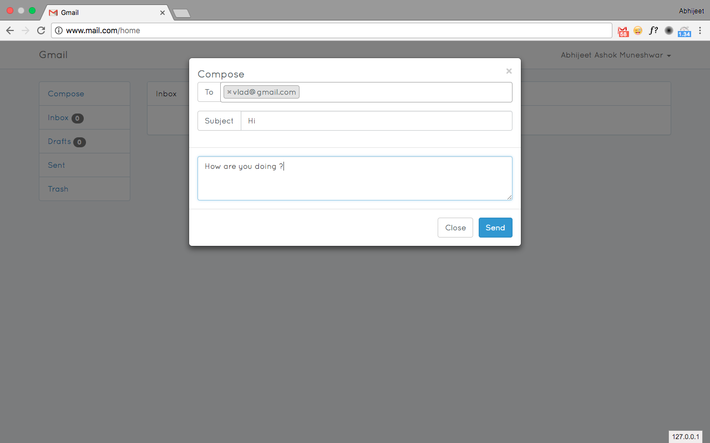
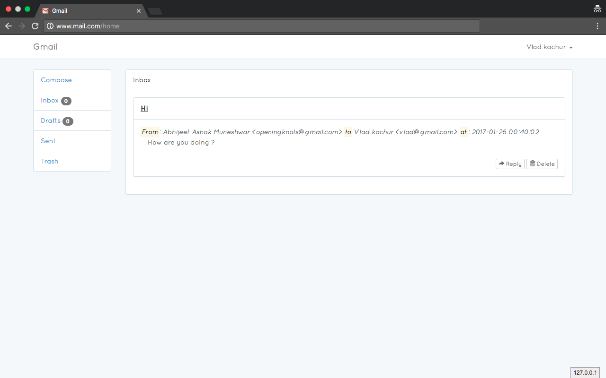
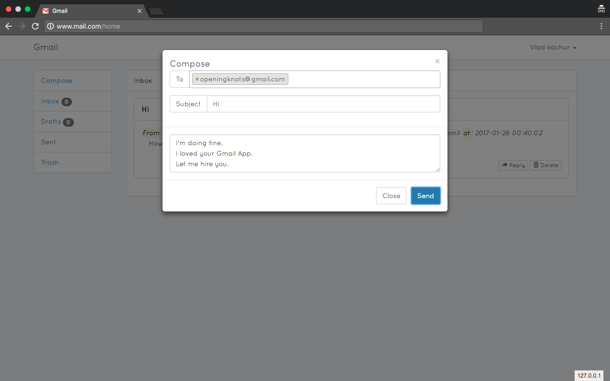
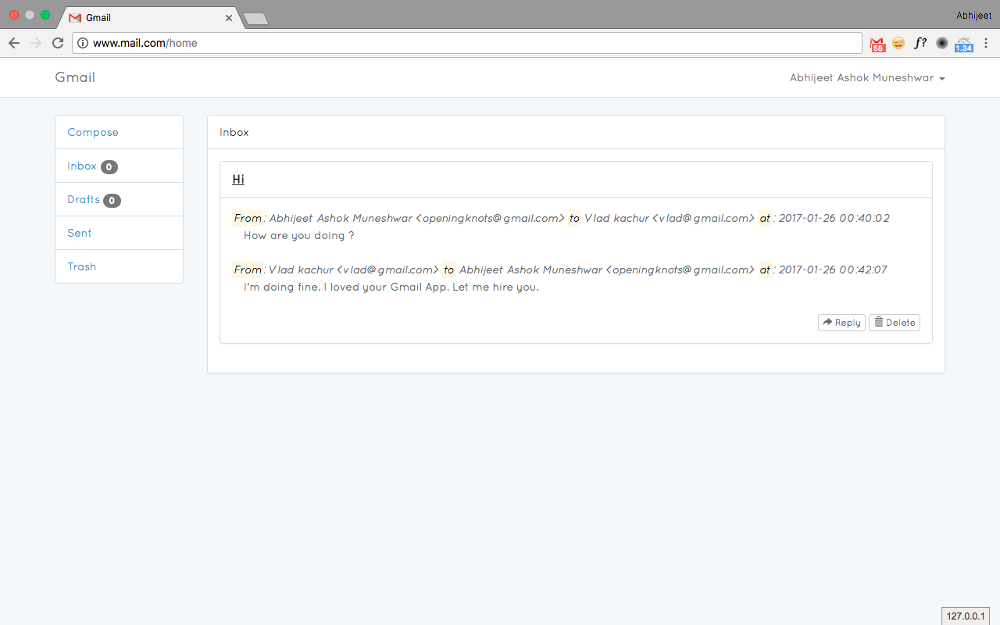
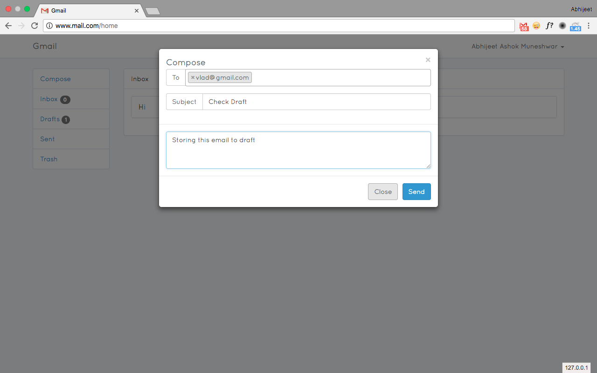
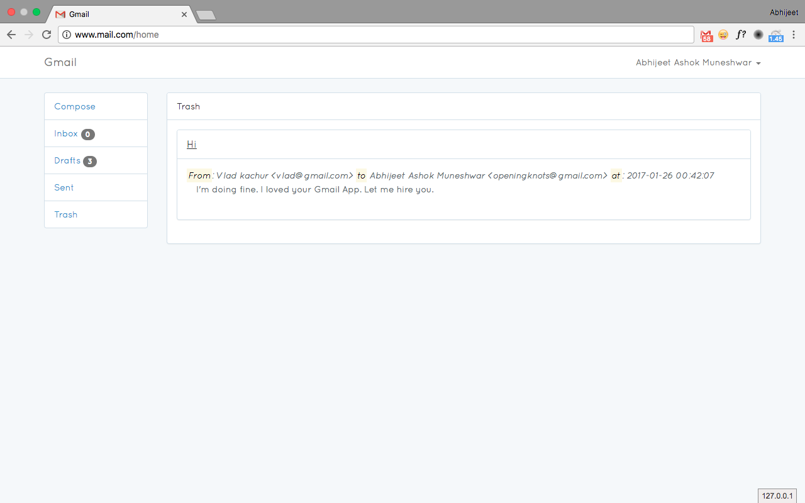

#Gmail

This simple app is similar to Gmail app developed using JavaScript, jQuery, Twitter Bootstrap, PHP, Laravel and MySQL.
It has below features

1. Inbox
2. Sent
3. Draft
4. Trash


Below are screen-shots:

1. Home Page
    

2. Registration
    

3. Login
    

4. Home Page
    

5. Compose Email
    

6. Email Received
    

7. Email Reply
    

8. Reply Received
    

9. Save to Draft
    

10. Drafted Email
    

11. Delete Email
    

12. Trashed Email
    


## Installation:

### Setting up database
1. The mysql file dump is stored at path: database/seeds/gmail.sql
2. Create new database with name as "gmail".
3) Import gmail.sql to this database.
4) Run below command

```sh
php artisan serve
```